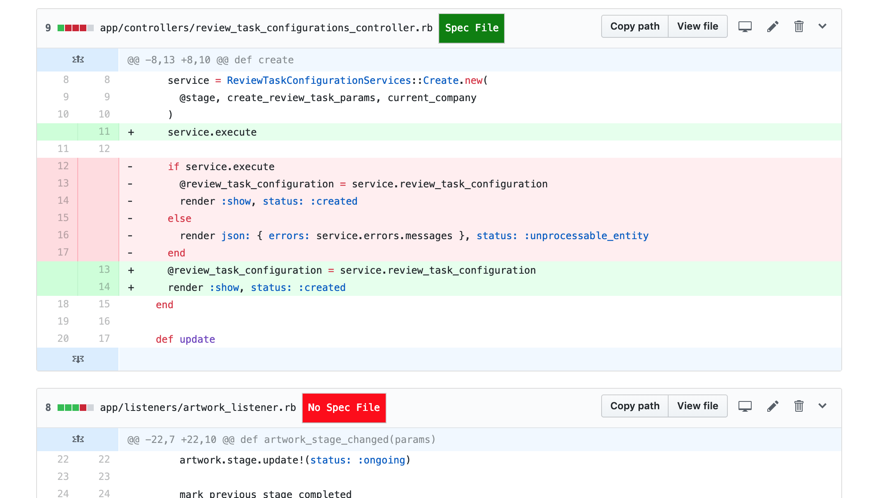
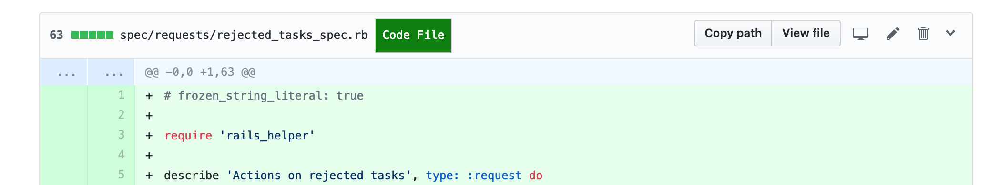

# spec-review-extension-github
A PR review helper extension for toggling between spec file and code file for RubyOnRails projects

We often want to see the test file while reviewing a PR, in github you needed to find those files
and then go there to see the tests. This helper will give a `Button` for toggling between viewing
the code and spec files.

This extension has been designed using chain of responsibility principle, and because of that it is
super simple to support other languages as well. (Currently it support only **RubyOnRails** Projects)

## Screenshots

